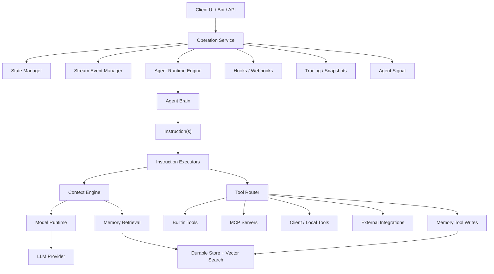
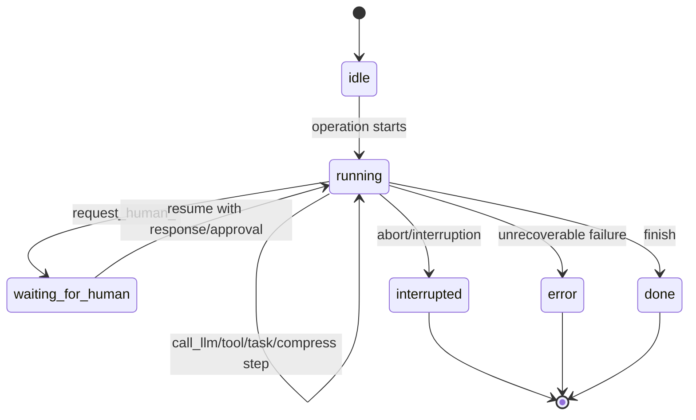
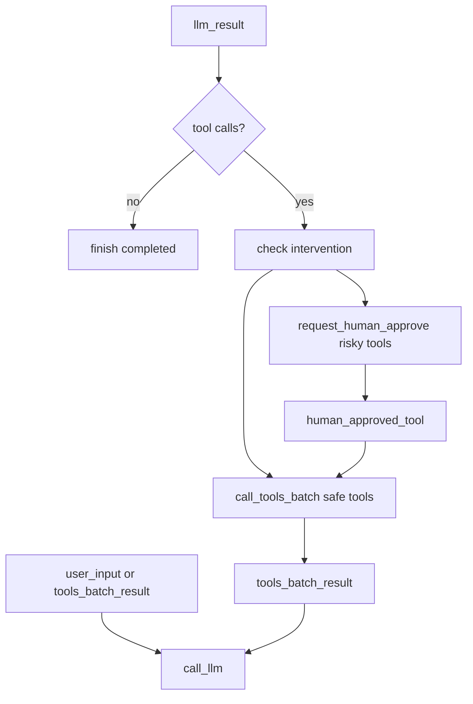
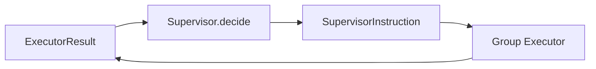
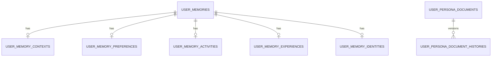
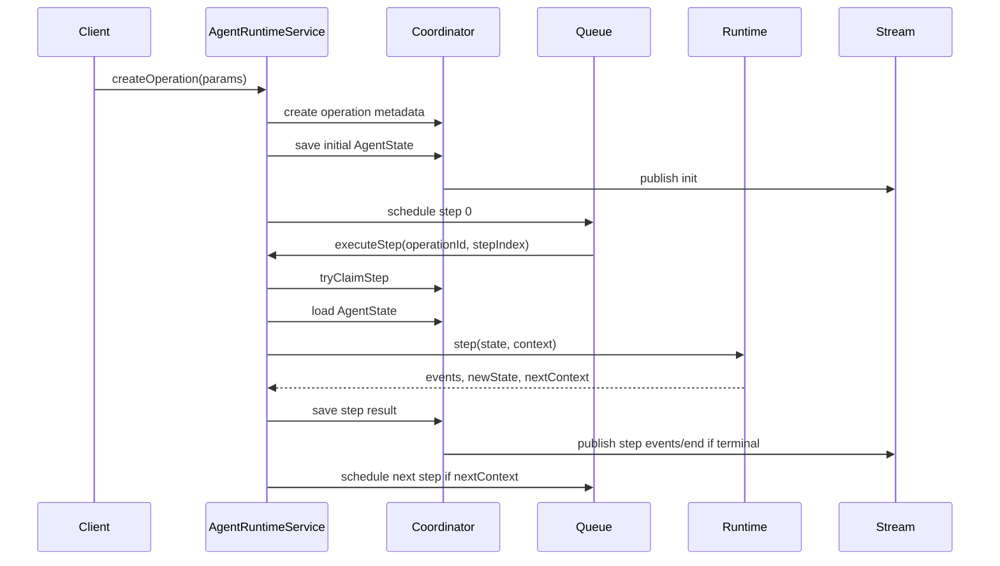
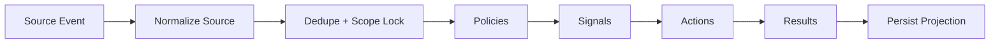

# Agent Runtime Portable Design

## Design Goals

This design describes a language-neutral architecture for the core agent platform. It captures the boundaries and contracts used by the current implementation while making the design portable to other languages.

Primary goals:

- Keep agent decision logic independent from execution mechanics.
- Keep model provider logic independent from agent runtime logic.
- Keep context construction independent from agent brains.
- Keep tool discovery, schema normalization, and execution routing explicit.
- Make server execution durable, streamable, resumable, and traceable.
- Allow alternative agent brains such as graph agents and group supervisors.
- Preserve memory, skills, MCP, human intervention, and security as first-class runtime features.

Related portability specs:

- [System Functional Specification](./sfs.md)
- [Implementation Contract](./implementation-contract.md)
- [API Contract](./api-contract.md)
- [Runtime Event Protocol](./runtime-event-protocol.md)
- [Provider Adapter Specification](./provider-adapter-spec.md)
- [Persistence And DDL Specification](./persistence-ddl-spec.md)
- [UI Functional Specification](./ui-functional-spec.md)
- [Conformance Test Plan](./conformance-test-plan.md)

## High-Level Architecture



## Layer Responsibilities

| Layer             | Responsibility                                                         | Must Not Own                                          |
| ----------------- | ---------------------------------------------------------------------- | ----------------------------------------------------- |
| Agent Brain       | Decide next instruction from context and state.                        | Provider protocols, database writes, queue mechanics. |
| Agent Runtime     | Execute instructions, mutate state, emit events, produce next context. | Prompt assembly policy, provider-specific formatting. |
| Model Runtime     | Normalize LLM providers.                                               | Agent state machine decisions.                        |
| Context Engine    | Assemble model-ready messages.                                         | Tool execution side effects.                          |
| Tool Engine       | Discover tools, normalize manifests, build enabled tool set.           | LLM provider transport.                               |
| Tool Router       | Execute tool calls by source and executor map.                         | Agent policy decisions.                               |
| Operation Service | Persist state, schedule steps, stream events, handle resume/abort.     | Agent brain decisions.                                |
| Memory Service    | Extract, store, embed, search, and inject user memory.                 | Runtime step scheduling.                              |
| Agent Signal      | Process semantic source events into signals/actions.                   | Synchronous chat response generation.                 |

## Core Domain Model

### Agent

An agent is stateless decision logic:

```ts
interface Agent {
  runner(
    context: AgentRuntimeContext,
    state: AgentState,
  ): Promise<AgentInstruction | AgentInstruction[]>;
  executors?: Partial<Record<InstructionType, InstructionExecutor>>;
  modelRuntime?: (payload: unknown) => AsyncIterable<unknown>;
  tools?: ToolRegistry;
  calculateUsage?: UsageCalculator;
  calculateCost?: CostCalculator;
}
```

Portable rule: all durable execution state belongs in `AgentState`, not in the agent instance. An implementation may hold constructor configuration, but step-to-step progress must be serializable.

### AgentRuntimeContext

Runtime context is the phase envelope passed to the agent:

```ts
interface AgentRuntimeContext {
  phase:
    | 'init'
    | 'user_input'
    | 'llm_result'
    | 'tool_result'
    | 'tools_batch_result'
    | 'task_result'
    | 'tasks_batch_result'
    | 'human_response'
    | 'human_approved_tool'
    | 'human_abort'
    | 'compression_result'
    | 'error';
  payload?: unknown;
  operationId?: string;
  metadata?: Record<string, unknown>;
  initialContext?: RuntimeInitialContext;
  stepContext?: RuntimeStepContext;
  stepUsage?: unknown;
  session?: {
    sessionId: string;
    status: AgentState['status'];
    stepCount: number;
    messageCount: number;
  };
}
```

`initialContext` is captured once at operation start. `stepContext` is recomputed at step boundaries for dynamic state such as active todos, device state, or page/editor context.

### AgentState

`AgentState` is the durable execution passport:

```ts
interface AgentState {
  operationId: string;
  status: 'idle' | 'running' | 'waiting_for_human' | 'done' | 'error' | 'interrupted';
  messages: Message[];
  metadata?: Record<string, unknown>;
  stepCount: number;
  createdAt: string;
  lastModified: string;
  modelRuntimeConfig?: ModelRuntimeConfig;
  tools?: ModelTool[];
  toolManifestMap: Record<string, ToolManifest>;
  toolExecutorMap?: Record<string, ToolExecutorRef>;
  toolSourceMap?: Record<string, ToolSourceRef>;
  operationToolSet?: OperationToolSet;
  pendingToolsCalling?: ToolCall[];
  pendingHumanPrompt?: PendingPrompt;
  pendingHumanSelect?: PendingSelect;
  userInterventionConfig?: UserInterventionConfig;
  securityBlacklist?: SecurityBlacklistConfig;
  usage: Usage;
  cost: Cost;
  costLimit?: CostLimit;
  maxSteps?: number;
  forceFinish?: boolean;
  interruption?: InterruptionRecord;
  activatedStepTools?: ActivatedStepTool[];
  activatedStepSkills?: ActivatedStepSkill[];
  error?: unknown;
}
```

State must be cloneable and persistable. Avoid closures, live connections, and language-specific object references.

## Runtime State Machine



`waiting_for_human` is stream-terminal for the current operation id but resumable through a later resume path. This prevents clients from waiting forever on a stream that will not produce more events while preserving the paused state.

## Step Algorithm

Portable runtime step algorithm:

1. Load current state.
2. Clone state.
3. Increment `stepCount`.
4. Update `lastModified`.
5. Check max step policy.
6. Compute or receive runtime context.
7. If context phase is `human_approved_tool`, synthesize a `call_tool` instruction for the approved pending tool.
8. Otherwise call `agent.runner(context, state)`.
9. Normalize result to an instruction array.
10. Normalize legacy instruction payloads if needed.
11. Execute instructions sequentially.
12. Merge each executor result into current state.
13. Accumulate events.
14. Stop early if state becomes `waiting_for_human` or `interrupted`.
15. Preserve step count and timestamp.
16. If instruction was `finish`, undo the step increment because finish is not a real work step.
17. Return `{ events, newState, nextContext }`.

## Instruction Executors

Instruction executors are runtime plugins:

```ts
type InstructionExecutor = (
  instruction: AgentInstruction,
  state: AgentState,
  context: AgentRuntimeContext,
) => Promise<{
  events: AgentEvent[];
  newState: AgentState;
  nextContext?: AgentRuntimeContext;
}>;
```

Executor precedence:

1. Built-in runtime executors
2. Runtime configuration executors
3. Agent-provided executors

This allows tests, server runtime, desktop runtime, and custom agents to override behavior without changing the core runtime.

## Instruction Semantics

### `call_llm`

Input:

- messages
- provider
- model
- tools
- optional parent id
- optional first-message marker

Execution:

1. Run context engineering over messages and operation metadata.
2. Normalize model/provider/tool payload.
3. Call model runtime.
4. Stream chunks as events.
5. Collect final assistant result.
6. Persist assistant message.
7. Parse tool calls if present.
8. Return `llm_result` next context.

### `call_tool`

Execution:

1. Validate tool call identifier and API name.
2. Resolve executor by source map and executor map.
3. Dispatch before-tool hooks.
4. Execute or mock tool.
5. Append new tool message unless `skipCreateToolMessage` is true.
6. Update pending tool message when resuming approved calls.
7. Dispatch after-tool or error hooks.
8. Return `tool_result` next context.

### `call_tools_batch`

Execution:

1. Execute all calls through the same routing and hook pipeline.
2. Preserve tool-call ids.
3. Add exactly one tool result per new tool call.
4. Do not re-add old tool messages from prior batches.
5. Return `tools_batch_result`.

Parallelism may be used when tools are independent. Ordering should be deterministic in state.

### `request_human_approve`

Execution:

1. Store pending tool calls in state.
2. Set state to `waiting_for_human`.
3. Emit `human_approve_required`.
4. End the current event stream.

Resume path:

1. User approves, rejects, or rejects-and-continues.
2. Runtime creates resume context.
3. Approved tool executes with `skipCreateToolMessage` where needed.
4. Rejection either stops or continues according to policy.

### `request_human_prompt` and `request_human_select`

These store pending prompt/select state, emit the corresponding event, and pause operation until a user response is provided.

### `compress_context`

Execution:

1. Dispatch `beforeCompact`.
2. Call configured compression model or compression chain.
3. Replace selected message history with compressed baseline.
4. Emit `compression_complete`.
5. Dispatch `afterCompact`.
6. Continue with `compression_result`.

On failure emit `compression_error`, dispatch `onCompactError`, and either recover or fail depending on policy.

### `exec_task` and `exec_tasks`

Tasks spawn isolated work:

- server-side child operation for normal tasks
- client-side operation for local/desktop tasks
- optional inherited messages
- timeout handling
- result fed back to parent as `task_result` or `tasks_batch_result`

### `finish`

Sets state to `done` unless the finish reason maps to another terminal state. Emits `done` with final state and reason.

## Default General Chat Agent Design

The general chat agent is phase-driven.



Intervention check order:

1. Parse tool arguments.
2. Run global security audits.
3. Apply headless mode behavior.
4. Resolve tool manifest.
5. Run dynamic per-tool policy.
6. Apply non-overridable global block.
7. Apply explicit `always` rules.
8. Apply auto-run mode.
9. Require approval for unknown tools in manual/allow-list modes.
10. Apply allow-list mode.
11. Apply manual intervention checker.

## Graph Agent Design

Graph agent decorates the general chat agent.

Graph context stored in `state.metadata.__graphContext`:

```ts
interface GraphContext {
  currentNode: string;
  nodeActive: boolean;
  extracting?: boolean;
  input: string;
  store: Record<string, Record<string, unknown>>;
  visitCount: Record<string, number>;
  backtrackCount: number;
}
```

Execution:

1. Initialize graph context with entry node and latest user input.
2. Start current node.
3. For `agent` node:
   - append rendered node prompt as user message
   - pass current tools
   - delegate phases to general chat agent
   - intercept inner `finish`
   - run extraction LLM call with tools disabled
4. For `llm` node:
   - append rendered prompt and JSON schema instruction
   - call LLM with tools disabled
5. Parse latest assistant JSON or store raw content.
6. Store output under node id.
7. If terminal, finish.
8. Evaluate transitions.
9. Backtrack or advance.

Portable graph prompt variables:

- `{{input.question}}`
- `{{stateId.field}}`

Transition evaluation should be deterministic and sandboxed if graph definitions are not trusted.

## Group Orchestration Design

Group orchestration uses a different loop:



Supervisor is the state machine. Executors perform side effects.

Core decisions:

- speak: one agent responds
- broadcast: several agents respond in parallel
- delegate: another agent takes control
- execute task: one background task
- execute tasks: parallel background tasks
- finish: stop

The same `AgentState` shape is reused for messages, usage, status, and step count.

## Model Runtime Boundary

The model runtime interface should expose:

```ts
interface ModelRuntime {
  chat(payload: ChatPayload, options: RuntimeOptions): AsyncIterable<ModelChunk>;
  embeddings(payload: EmbeddingPayload, options: RuntimeOptions): Promise<number[][]>;
}
```

Provider adapters normalize:

- role/message formats
- system message placement
- tool schema format
- structured output support
- tool-call streaming
- tool-call ids
- reasoning content
- usage accounting
- error payloads

The context builder for each provider must validate tool schemas. Invalid top-level schemas, string schemas, and non-object tool-call chunks must not propagate to provider SDK validation.

## Context Engine Design

Context engine is a processor pipeline.

Recommended phases:

1. History truncation.
2. System message assembly.
3. First-user-message context injection.
4. Message enrichment and post-processing.

System assembly processors:

- agent documents before system
- system role
- eval/bot/discord context
- system date
- skill context
- tool system role
- history summary
- agent document append/replace

First-user injection processors:

- user memory
- group context
- agent management context
- group agent builder context
- agent builder context
- file/knowledge context
- GTD plan/todos
- topic references
- page/editor context
- selected tools/skills

Processors should be pure where possible and return updated pipeline context plus metadata.

## Tool Architecture

Tool data model:

```ts
interface ToolDescriptor {
  identifier: string;
  apiName: string;
  manifest: ToolManifest;
  schema: JsonSchemaObject;
  source: ToolSource;
  executor: ToolExecutorRef;
  humanIntervention?: InterventionPolicy;
}
```

Tool resolution pipeline:

1. Load builtin tools.
2. Load installed plugin tools.
3. Load MCP tools.
4. Load Klavis/external integration tools.
5. Load skill-contributed tools.
6. Apply agent/user enablement.
7. Apply mode-specific filtering, for example disable GTD in subtasks.
8. Apply hidden/internal tool rules.
9. Normalize schemas.
10. Build:
    - model tools
    - manifest map
    - executor map
    - source map
    - enabled tool ids

Execution router:

- builtin server runtime
- builtin client runtime
- MCP runtime
- local system runtime
- external integration runtime
- markdown/standalone renderer where applicable

## Skill Architecture

Skills are capability bundles. A portable implementation should model:

```ts
interface Skill {
  identifier: string;
  metadata: SkillMetadata;
  content?: string;
  tools?: ToolDescriptor[];
  activation?: ActivationPolicy;
}
```

Skill paths:

- selected by user or agent config
- preloaded before send
- injected into context
- activated dynamically by tool/skill activator
- tracked in `activatedStepSkills`

Skills should not require the core runtime to understand their internal file layout. Skill loading is an adapter concern.

## MCP Architecture

MCP integration should be treated as a tool source:

1. Discover MCP server configuration.
2. Establish server/session transport.
3. List tools.
4. Normalize MCP tool schemas.
5. Expose tools through the same model tool set.
6. Route tool calls back to the owning MCP server.
7. Convert MCP results to runtime tool messages.

The runtime should not distinguish MCP calls after routing. They are normal tool results in `AgentState.messages`.

## Memory Architecture

Memory has three runtime-facing surfaces:

1. Context injection before LLM calls.
2. Tool-based search/write during agent execution.
3. Background extraction and persona update.

Storage model:



Base memory fields:

- id
- user id
- category/layer/type
- title
- summary and summary vector
- details and details vector
- metadata
- tags
- status
- captured/accessed timestamps
- access count

Layer records add domain-specific fields and vectors.

Retrieval:

1. Build query from topic user messages or explicit tool query.
2. Embed query.
3. Search layer vectors with effort-based top-k limits.
4. Return grouped results.
5. Cache topic results in client store where applicable.
6. Inject with `UserMemoryInjector`.

Creation:

- explicit memory tool creates layer record plus base memory transactionally
- background extractor generates candidates from conversation, embeds fields, and persists
- persona writer builds narrative persona from identities and recent memories

## Persistence Schema Design

This section defines the portable database schema needed to build the runtime. The current implementation uses Postgres plus vector columns for user memory and Redis or in-memory storage for live agent operations. A reimplementation may use different storage engines, but it should preserve these logical tables/collections and indexes.

### Data Type Conventions

| Logical type   | Example implementation                                  |
| -------------- | ------------------------------------------------------- |
| `id`           | string, uuid, cuid, nanoid, or database-generated key   |
| `timestamp`    | timezone-aware timestamp                                |
| `json`         | JSON/JSONB/document object                              |
| `string_array` | text array or JSON string array                         |
| `vector_1024`  | 1024-dimensional vector column or vector index document |
| `money`        | decimal/numeric plus currency                           |

All user-owned records should include `user_id` and enforce user isolation through query filters or row-level security.

### Core Conversation Tables

Memory retrieval and agent execution both depend on source conversation data.

```sql
users (
  id primary key,
  ...profile/auth fields
)

topics (
  id primary key,
  user_id references users(id),
  title,
  metadata json,
  created_at timestamp,
  updated_at timestamp
)

messages (
  id primary key,
  user_id references users(id),
  topic_id references topics(id),
  thread_id nullable,
  parent_id nullable,
  role,              -- system | user | assistant | tool
  content,           -- text or serialized rich content
  metadata json,
  tools json,
  tool_call_id nullable,
  created_at timestamp,
  updated_at timestamp
)
```

Recommended indexes:

- `topics(user_id, updated_at)`
- `messages(user_id, topic_id, created_at)`
- `messages(parent_id)`
- `messages(tool_call_id)`

Topic memory retrieval must be able to concatenate or summarize recent user messages for a topic.

### Agent Definition Tables

Agents are persisted separately from runtime operations. A runtime operation snapshots the agent config it used so later edits to the agent do not mutate a running operation.

```sql
agents (
  id primary key,
  slug,
  title,
  description,
  tags json,
  editor_data json,
  avatar,
  background_color,
  market_identifier,
  plugins json,                 -- enabled plugin/tool identifiers
  client_id,
  user_id references users(id) on delete cascade,
  agency_config json,
  chat_config json,
  few_shots json,
  model,
  params json,
  provider,
  system_role text,
  tts json,
  virtual boolean default false,
  pinned boolean,
  opening_message text,
  opening_questions text[],
  session_group_id,
  created_at timestamp,
  updated_at timestamp,
  unique (client_id, user_id),
  unique (slug, user_id)
)

agents_files (
  file_id references files(id) on delete cascade,
  agent_id references agents(id) on delete cascade,
  user_id references users(id) on delete cascade,
  enabled boolean default true,
  created_at timestamp,
  updated_at timestamp,
  primary key (file_id, agent_id, user_id)
)

agents_knowledge_bases (
  agent_id references agents(id) on delete cascade,
  knowledge_base_id references knowledge_bases(id) on delete cascade,
  user_id references users(id) on delete cascade,
  enabled boolean default true,
  created_at timestamp,
  updated_at timestamp,
  primary key (agent_id, knowledge_base_id)
)
```

Recommended indexes:

- `agents(user_id)`
- `agents(title)`
- `agents(description)`
- `agents(session_group_id)`
- `agents_files(agent_id)`, `agents_files(file_id)`, `agents_files(user_id)`
- `agents_knowledge_bases(agent_id)`, `agents_knowledge_bases(knowledge_base_id)`, `agents_knowledge_bases(user_id)`

### Group Agent Tables

Group orchestration requires durable group membership and supervisor configuration.

```sql
chat_groups (
  id primary key,
  title,
  description,
  avatar,
  background_color,
  market_identifier,
  content text,
  editor_data json,
  config json,                  -- supervisor, collaboration, routing settings
  client_id,
  user_id references users(id) on delete cascade,
  group_id,
  pinned boolean default false,
  created_at timestamp,
  updated_at timestamp,
  unique (client_id, user_id)
)

chat_groups_agents (
  chat_group_id references chat_groups(id) on delete cascade,
  agent_id references agents(id) on delete cascade,
  user_id references users(id) on delete cascade,
  enabled boolean default true,
  "order" integer default 0,
  role default 'participant',
  created_at timestamp,
  updated_at timestamp,
  primary key (chat_group_id, agent_id)
)
```

### Model And Provider Tables

Provider and model config should be user-scoped because users can override keys, settings, fetch mode, model availability, and pricing.

```sql
ai_providers (
  id,
  user_id references users(id) on delete cascade,
  name,
  sort integer,
  enabled boolean,
  fetch_on_client boolean,
  check_model,
  logo,
  description,
  key_vaults text,              -- encrypted secret material
  source,                       -- builtin | custom
  settings json,
  config json,
  created_at timestamp,
  updated_at timestamp,
  primary key (id, user_id)
)

ai_models (
  id,
  provider_id,
  user_id references users(id) on delete cascade,
  display_name,
  description,
  organization,
  enabled boolean,
  type default 'chat',          -- chat | embedding | image | etc.
  sort integer,
  pricing json,
  parameters json,
  config json,
  abilities json,
  context_window_tokens integer,
  source,                       -- remote | custom | builtin
  released_at,
  settings json,
  created_at timestamp,
  updated_at timestamp,
  primary key (id, provider_id, user_id)
)
```

Indexes:

- `ai_providers(user_id)`
- `ai_models(user_id)`

### Knowledge, File, And RAG Tables

Knowledge and files are part of core agent context because agents can bind files and knowledge bases, context engineering injects them, and RAG retrieval uses chunks and embeddings.

```sql
global_files (
  hash_id primary key,
  file_type not null,
  size integer not null,
  url not null,
  metadata json,
  creator references users(id),
  created_at timestamp,
  accessed_at timestamp
)

files (
  id primary key,
  user_id references users(id) on delete cascade,
  file_type not null,
  file_hash references global_files(hash_id),
  name not null,
  size integer not null,
  url not null,
  source,
  parent_id,
  client_id,
  metadata json,
  chunk_task_id,
  embedding_task_id,
  created_at timestamp,
  updated_at timestamp,
  unique (client_id, user_id)
)

documents (
  id primary key,
  title,
  description,
  content text,
  file_type not null,
  filename,
  total_char_count integer not null,
  total_line_count integer not null,
  metadata json,
  pages json,
  source_type not null,         -- file | web | api | topic
  source not null,
  file_id references files(id),
  knowledge_base_id references knowledge_bases(id),
  parent_id references documents(id),
  user_id references users(id) on delete cascade,
  client_id,
  editor_data json,
  slug,
  created_at timestamp,
  updated_at timestamp,
  unique (client_id, user_id),
  unique (slug, user_id)
)

knowledge_bases (
  id primary key,
  name not null,
  description,
  avatar,
  type,
  user_id references users(id) on delete cascade,
  client_id,
  is_public boolean default false,
  settings json,
  created_at timestamp,
  updated_at timestamp,
  unique (client_id, user_id)
)

knowledge_base_files (
  knowledge_base_id references knowledge_bases(id) on delete cascade,
  file_id references files(id) on delete cascade,
  user_id references users(id) on delete cascade,
  created_at timestamp,
  updated_at timestamp,
  primary key (knowledge_base_id, file_id)
)
```

RAG chunk and vector tables:

```sql
chunks (
  id primary key,
  text text,
  abstract text,
  metadata json,
  "index" integer,
  type,
  client_id,
  user_id references users(id) on delete cascade,
  created_at timestamp,
  updated_at timestamp,
  unique (client_id, user_id)
)

unstructured_chunks (
  id primary key,
  text text,
  metadata json,
  "index" integer,
  type,
  parent_id,
  composite_id references chunks(id) on delete cascade,
  client_id,
  user_id references users(id) on delete cascade,
  file_id references files(id) on delete cascade,
  created_at timestamp,
  updated_at timestamp,
  unique (client_id, user_id)
)

embeddings (
  id primary key,
  chunk_id references chunks(id) on delete cascade unique,
  embeddings vector_1024,
  model,
  client_id,
  user_id references users(id) on delete cascade,
  unique (client_id, user_id)
)

document_chunks (
  document_id references documents(id) on delete cascade,
  chunk_id references chunks(id) on delete cascade,
  page_index integer,
  user_id references users(id) on delete cascade,
  created_at timestamp,
  primary key (document_id, chunk_id)
)
```

Recommended indexes:

- all `user_id` fields
- document `source`, `source_type`, `file_id`, `parent_id`, `knowledge_base_id`
- file `file_hash`, `parent_id`, task ids
- chunk/embedding foreign keys
- vector index on `embeddings.embeddings`

### User Memory Tables

The memory schema has one base table plus layer-specific tables.

```sql
user_memories (
  id primary key,
  user_id references users(id) on delete cascade,
  memory_category,
  memory_layer,              -- context | experience | preference | activity | identity
  memory_type,
  metadata json,
  tags string_array,
  title,
  summary text,
  summary_vector_1024 vector_1024,
  details text,
  details_vector_1024 vector_1024,
  status,
  accessed_count integer default 0,
  last_accessed_at timestamp not null,
  captured_at timestamp not null default now,
  created_at timestamp,
  updated_at timestamp
)
```

Indexes:

- `user_memories(user_id)`
- vector index on `summary_vector_1024`
- vector index on `details_vector_1024`

```sql
user_memories_contexts (
  id primary key,
  user_id references users(id) on delete cascade,
  user_memory_ids json,       -- current implementation stores string[]
  metadata json,
  tags string_array,
  associated_objects json,
  associated_subjects json,
  title text,
  description text,
  description_vector vector_1024,
  type,
  current_status text,
  score_impact numeric default 0,
  score_urgency numeric default 0,
  captured_at timestamp not null default now,
  created_at timestamp,
  updated_at timestamp
)
```

Indexes:

- `user_memories_contexts(user_id)`
- `user_memories_contexts(type)`
- vector index on `description_vector`

```sql
user_memories_preferences (
  id primary key,
  user_id references users(id) on delete cascade,
  user_memory_id references user_memories(id) on delete cascade,
  metadata json,
  tags string_array,
  conclusion_directives text,
  conclusion_directives_vector vector_1024,
  type,
  suggestions text,
  score_priority numeric default 0,
  captured_at timestamp not null default now,
  created_at timestamp,
  updated_at timestamp
)
```

Indexes:

- `user_memories_preferences(user_id)`
- `user_memories_preferences(user_memory_id)`
- vector index on `conclusion_directives_vector`

```sql
user_memories_activities (
  id primary key,
  user_id references users(id) on delete cascade,
  user_memory_id references user_memories(id) on delete cascade,
  metadata json,
  tags string_array,
  type not null,
  status not null default 'pending',
  timezone,
  starts_at timestamp,
  ends_at timestamp,
  associated_objects json,
  associated_subjects json,
  associated_locations json,
  notes text,
  narrative text,
  narrative_vector vector_1024,
  feedback text,
  feedback_vector vector_1024,
  captured_at timestamp not null default now,
  created_at timestamp,
  updated_at timestamp
)
```

Indexes:

- `user_memories_activities(user_id)`
- `user_memories_activities(user_memory_id)`
- `user_memories_activities(type)`
- `user_memories_activities(status)`
- vector index on `narrative_vector`
- vector index on `feedback_vector`

```sql
user_memories_identities (
  id primary key,
  user_id references users(id) on delete cascade,
  user_memory_id references user_memories(id) on delete cascade,
  metadata json,
  tags string_array,
  type,
  description text,
  description_vector vector_1024,
  episodic_date timestamp,
  relationship,
  role text,
  captured_at timestamp not null default now,
  created_at timestamp,
  updated_at timestamp
)
```

Indexes:

- `user_memories_identities(user_id)`
- `user_memories_identities(user_memory_id)`
- `user_memories_identities(type)`
- vector index on `description_vector`

```sql
user_memories_experiences (
  id primary key,
  user_id references users(id) on delete cascade,
  user_memory_id references user_memories(id) on delete cascade,
  metadata json,
  tags string_array,
  type,
  situation text,
  situation_vector vector_1024,
  reasoning text,
  possible_outcome text,
  action text,
  action_vector vector_1024,
  key_learning text,
  key_learning_vector vector_1024,
  score_confidence real default 0,
  captured_at timestamp not null default now,
  created_at timestamp,
  updated_at timestamp
)
```

Indexes:

- `user_memories_experiences(user_id)`
- `user_memories_experiences(user_memory_id)`
- `user_memories_experiences(type)`
- vector index on `situation_vector`
- vector index on `action_vector`
- vector index on `key_learning_vector`

### Persona Tables

Persona is a generated profile document derived from identity and memory records.

```sql
user_memory_persona_documents (
  id primary key,
  user_id references users(id) on delete cascade,
  profile not null default 'default',
  tagline text,
  persona text,
  memory_ids json,
  source_ids json,
  metadata json,
  version integer not null default 1,
  captured_at timestamp not null default now,
  created_at timestamp,
  updated_at timestamp,
  unique (user_id, profile)
)
```

Indexes:

- `user_memory_persona_documents(user_id)`
- unique `(user_id, profile)`

```sql
user_memory_persona_document_histories (
  id primary key,
  user_id references users(id) on delete cascade,
  persona_id references user_memory_persona_documents(id) on delete cascade,
  profile not null default 'default',
  snapshot_persona text,
  snapshot_tagline text,
  reasoning text,
  diff_persona text,
  diff_tagline text,
  snapshot text,
  summary text,
  edited_by default 'agent',
  memory_ids json,
  source_ids json,
  metadata json,
  previous_version integer,
  next_version integer,
  captured_at timestamp not null default now,
  created_at timestamp,
  updated_at timestamp
)
```

Indexes:

- `user_memory_persona_document_histories(persona_id)`
- `user_memory_persona_document_histories(user_id)`
- `user_memory_persona_document_histories(profile)`

### Agent Runtime Operation Tables

The current implementation stores live state in Redis keys:

- `agent_runtime_state:{operationId}`
- `agent_runtime_steps:{operationId}`
- `agent_runtime_meta:{operationId}`
- `agent_runtime_events:{operationId}`

For a portable durable implementation, model the same data as tables or document collections.

```sql
agent_runtime_operations (
  operation_id primary key,
  user_id,
  agent_id nullable,
  topic_id nullable,
  thread_id nullable,
  task_id nullable,
  status,                       -- idle | running | waiting_for_human | done | error | interrupted
  agent_config json,
  model_runtime_config json,
  metadata json,
  total_steps integer default 0,
  total_cost numeric default 0,
  created_at timestamp,
  last_active_at timestamp,
  expires_at timestamp
)
```

Indexes:

- `agent_runtime_operations(user_id, last_active_at)`
- `agent_runtime_operations(status)`
- `agent_runtime_operations(expires_at)`

```sql
agent_runtime_states (
  operation_id primary key references agent_runtime_operations(operation_id) on delete cascade,
  state json not null,
  step_count integer,
  status,
  updated_at timestamp,
  expires_at timestamp
)
```

```sql
agent_runtime_steps (
  id primary key,
  operation_id references agent_runtime_operations(operation_id) on delete cascade,
  step_index integer not null,
  status,
  context json,
  next_context json,
  events json,
  execution_time_ms integer,
  cost numeric,
  created_at timestamp,
  unique (operation_id, step_index)
)
```

```sql
agent_runtime_stream_events (
  id primary key,
  operation_id references agent_runtime_operations(operation_id) on delete cascade,
  step_index integer,
  sequence integer not null,
  type not null,
  data json,
  timestamp timestamp,
  unique (operation_id, sequence)
)
```

```sql
agent_runtime_step_locks (
  operation_id,
  step_index integer,
  lock_token,
  expires_at timestamp,
  primary key (operation_id, step_index)
)
```

Step claim must be atomic:

```sql
insert into agent_runtime_step_locks(operation_id, step_index, lock_token, expires_at)
values (?, ?, ?, ?)
on conflict (operation_id, step_index)
do nothing;
```

If the insert succeeds, the worker owns the step. Expired locks may be cleaned or overwritten depending on database support.

### Trace Snapshot Tables

The current tracing store can be file or object storage. A database-backed implementation can use:

```sql
agent_execution_snapshots (
  trace_id primary key,
  operation_id unique,
  user_id,
  agent_id,
  topic_id,
  provider,
  model,
  started_at timestamp,
  completed_at timestamp,
  completion_reason,
  total_steps integer,
  total_tokens integer,
  total_cost numeric,
  error json,
  snapshot json
)
```

For queryable step traces:

```sql
agent_execution_snapshot_steps (
  id primary key,
  trace_id references agent_execution_snapshots(trace_id) on delete cascade,
  operation_id,
  step_index integer,
  step_type,                    -- call_llm | call_tool
  step_label,
  started_at timestamp,
  completed_at timestamp,
  execution_time_ms integer,
  messages_baseline json,
  messages_delta json,
  context json,
  events json,
  tools_calling json,
  tools_result json,
  input_tokens integer,
  output_tokens integer,
  total_tokens integer,
  total_cost numeric,
  unique (trace_id, step_index)
)
```

Object storage is acceptable if snapshots remain retrievable by operation id and trace id.

### Tool, MCP, And Skill Configuration Tables

Static builtin tools can live in code. User-installed or remote capabilities need durable configuration.

```sql
agent_tool_configs (
  id primary key,
  user_id,
  agent_id nullable,
  identifier not null,
  source not null,              -- builtin | mcp | plugin | skill | klavis | local | server
  enabled boolean,
  manifest json,
  schema json,
  executor_ref json,
  human_intervention json,
  metadata json,
  created_at timestamp,
  updated_at timestamp
)
```

```sql
mcp_servers (
  id primary key,
  user_id,
  identifier not null,
  name,
  transport,                    -- stdio | http | sse | websocket
  config json,
  auth json,
  status,
  created_at timestamp,
  updated_at timestamp,
  unique (user_id, identifier)
)

mcp_tools (
  id primary key,
  server_id references mcp_servers(id) on delete cascade,
  identifier not null,
  api_name not null,
  manifest json,
  schema json,
  enabled boolean,
  created_at timestamp,
  updated_at timestamp,
  unique (server_id, identifier, api_name)
)
```

```sql
skills (
  id primary key,
  user_id nullable,
  identifier not null,
  source,                       -- builtin | marketplace | local | github
  metadata json,
  content text,
  tools json,
  version,
  created_at timestamp,
  updated_at timestamp
)

agent_skills (
  id primary key,
  user_id,
  agent_id,
  skill_identifier,
  enabled boolean,
  config json,
  created_at timestamp,
  updated_at timestamp,
  unique (agent_id, skill_identifier)
)
```

The current codebase has concrete `agent_skills` and `agent_documents` tables. Use them in addition to generic tool config.

```sql
agent_skills (
  id primary key,
  name not null,
  description not null,
  identifier not null,
  source not null,              -- builtin | market | user
  manifest json not null,
  content text,
  editor_data json,
  resources json,
  zip_file_hash references global_files(hash_id),
  user_id references users(id) on delete cascade,
  created_at timestamp,
  updated_at timestamp,
  unique (user_id, name)
)

agent_documents (
  id primary key,
  user_id references users(id) on delete cascade,
  agent_id references agents(id) on delete cascade,
  document_id references documents(id) on delete cascade,
  template_id,
  access_self integer default 31,
  access_shared integer default 0,
  access_public integer default 0,
  policy_load default 'always',
  policy json,
  policy_load_position default 'before-first-user',
  policy_load_format default 'raw',
  policy_load_rule default 'always',
  deleted_at timestamp,
  deleted_by_user_id references users(id),
  deleted_by_agent_id references agents(id),
  delete_reason text,
  created_at timestamp,
  updated_at timestamp
)
```

`agent_documents` is useful when agent documents are durable state, operating rules, prompt templates, or context assets with access-policy semantics.

### Task Link Tables

Async agent tasks should be linkable to topics and operations.

```sql
async_tasks (
  id primary key,
  type,
  status,
  error json,
  inference_id,
  user_id references users(id) on delete cascade,
  duration integer,
  parent_id,
  metadata json not null default '{}',
  created_at timestamp,
  updated_at timestamp
)

tasks (
  id primary key,
  identifier not null,
  seq integer not null,
  created_by_user_id references users(id) on delete cascade,
  created_by_agent_id references agents(id),
  assignee_user_id references users(id),
  assignee_agent_id references agents(id),
  parent_task_id references tasks(id),
  name,
  description,
  instruction text not null,
  status default 'backlog',
  priority integer default 0,
  sort_order integer default 0,
  automation_mode,              -- heartbeat | schedule
  heartbeat_interval integer,
  heartbeat_timeout integer,
  last_heartbeat_at timestamp,
  schedule_pattern,
  schedule_timezone default 'UTC',
  total_topics integer default 0,
  max_topics integer,
  current_topic_id references topics(id),
  context json default '{}',
  config json default '{}',
  error text,
  started_at timestamp,
  completed_at timestamp,
  created_at timestamp,
  updated_at timestamp
)

task_dependencies (
  id primary key,
  task_id references tasks(id) on delete cascade,
  depends_on_id references tasks(id) on delete cascade,
  user_id references users(id) on delete cascade,
  type default 'blocks',
  condition json,
  created_at timestamp,
  unique (task_id, depends_on_id)
)

task_documents (
  id primary key,
  task_id references tasks(id) on delete cascade,
  document_id references documents(id) on delete cascade,
  user_id references users(id) on delete cascade,
  pinned_by default 'agent',
  created_at timestamp,
  unique (task_id, document_id)
)

task_topics (
  id primary key,
  task_id references tasks(id) on delete cascade,
  topic_id references topics(id),
  user_id references users(id) on delete cascade,
  seq integer not null,
  operation_id,
  status default 'running',
  handoff json,
  review_passed integer,
  review_score integer,
  review_scores json,
  review_iteration integer,
  reviewed_at timestamp,
  created_at timestamp,
  updated_at timestamp,
  unique (task_id, topic_id)
)

agent_cron_jobs (
  id primary key,
  agent_id references agents(id) on delete cascade,
  group_id references chat_groups(id) on delete cascade,
  user_id references users(id) on delete cascade,
  name,
  description,
  enabled boolean default true,
  cron_pattern not null,
  timezone default 'UTC',
  content text not null,
  edit_data json,
  max_executions integer,
  remaining_executions integer,
  execution_conditions json,
  last_executed_at timestamp,
  total_executions integer default 0,
  created_at timestamp,
  updated_at timestamp
)
```

Recommended indexes:

- `async_tasks(user_id)`, `(type, status)`, `inference_id`
- `tasks(created_by_user_id)`, `created_by_agent_id`, assignees, parent, status, priority, automation mode, heartbeat fields
- `task_topics(task_id)`, `topic_id`, `user_id`, `(task_id, status)`
- `agent_cron_jobs(agent_id)`, `group_id`, `user_id`, enabled, remaining executions, last executed

### Hook, Intervention, Audit, And Usage Tables

The runtime can keep hooks and interventions embedded in operation state. For an implementation that needs queryable history or webhook delivery, use explicit tables.

```sql
agent_runtime_hooks (
  id primary key,
  user_id references users(id) on delete cascade,
  agent_id references agents(id),
  operation_id,
  hook_type not null,
  target not null,              -- local | webhook | queue
  config json,
  enabled boolean default true,
  created_at timestamp,
  updated_at timestamp
)

agent_runtime_interventions (
  id primary key,
  operation_id not null,
  step_index integer,
  user_id references users(id) on delete cascade,
  agent_id references agents(id),
  type not null,                -- approve | prompt | select
  status not null,              -- pending | approved | rejected | answered | expired
  pending_tools json,
  prompt text,
  options json,
  response json,
  decision,
  rejection_reason text,
  created_at timestamp,
  updated_at timestamp
)

agent_runtime_audit_events (
  id primary key,
  operation_id,
  step_index integer,
  user_id references users(id) on delete cascade,
  agent_id references agents(id),
  event_type not null,
  severity,
  subject,
  payload json,
  created_at timestamp
)

agent_runtime_usage_events (
  id primary key,
  operation_id,
  step_index integer,
  user_id references users(id) on delete cascade,
  agent_id references agents(id),
  provider,
  model,
  usage json,
  cost json,
  created_at timestamp
)
```

Use the usage table when billing, analytics, or quota enforcement must survive trace cleanup.

### Agent Signal Tables

Agent Signal can use Redis, workflow state, or relational records. The logical schema is:

```sql
agent_signal_source_events (
  id primary key,
  source_type not null,
  source_id not null,
  scope_key not null,
  user_id,
  agent_id nullable,
  payload json,
  timestamp timestamp,
  created_at timestamp,
  unique (source_type, source_id)
)

agent_signal_scope_locks (
  scope_key primary key,
  lock_token,
  expires_at timestamp
)

agent_signal_nodes (
  id primary key,
  source_event_id references agent_signal_source_events(id) on delete cascade,
  node_type not null,           -- source | signal | action | result
  node_key,
  payload json,
  status,
  created_at timestamp
)

agent_signal_observability (
  id primary key,
  source_event_id references agent_signal_source_events(id) on delete cascade,
  scope_key,
  projection json,
  created_at timestamp
)
```

### Schema Invariants

- Every user-owned table must be filterable by `user_id`.
- Memory layer writes should be transactional with the base `user_memories` row.
- Vector dimensions must match the embedding model contract. The current implementation uses 1024 dimensions.
- Operation state must be stored as an opaque JSON document so new runtime metadata can be added without migrations.
- Stream events must have a monotonic sequence per operation.
- Step locks must have TTL/expiry semantics.
- Source event type strings and tool identifiers must be stable after persistence.
- Trace data should be redacted or selectively stored when it may contain secrets.

## Server Operation Runtime

Server operation flow:



State manager requirements:

- create operation metadata
- save/load state
- save step result and history
- list active operations
- stats
- cleanup expired operations
- step claiming/distributed lock

Stream manager requirements:

- publish init
- publish step events
- publish runtime end
- subscribe from cursor
- cleanup

Queue requirements:

- schedule step with operation id, step index, context, retries, retry delay
- support local in-process mode
- support distributed HTTP/message queue mode

## Client Runtime And Gateway

Client runtime is useful when:

- tools need browser or desktop state
- tools need local file system or shell access
- SPA state is needed before server roundtrip

Gateway runtime is useful when:

- execution should run on server
- client needs streaming and reconnect
- client may need to execute selected tools and send results back

Design rule: client and server runtime should share the same instruction/event/state contracts even if executors differ.

## Human Intervention Design

Intervention policy object should support:

- global approval mode
- allow-list
- static per-tool policies
- dynamic per-tool audits
- global audits
- security blacklist

Suggested decision result:

```ts
type InterventionDecision =
  | { action: 'execute'; toolCall: ToolCall }
  | { action: 'request_approval'; toolCall: ToolCall; reason?: string }
  | { action: 'skip'; toolCall: ToolCall; reason: string };
```

Persist pending intervention in state so approval can be resumed after reconnect.

## Hooks And Webhooks

Hook dispatch should be best-effort around lifecycle boundaries. Hook failure should not normally crash the operation unless a hook is explicitly configured as blocking.

Hook payloads should include:

- operation id
- user id
- agent id
- topic id
- step index
- status
- step type
- step label
- error details where applicable
- tool identifiers and arguments for tool hooks
- usage and cost where applicable

Tool mock support should be limited to trusted local/test hook handlers.

## Agent Signal Design

Agent Signal is a decoupled semantic automation pipeline.



Source event requirements:

- source type
- source id
- timestamp
- payload
- scope key

Scope key priority:

1. topic
2. bot thread
3. task
4. agent/user
5. user
6. fallback/global

Agent Signal actions may trigger memory handling, skill management, prompt updates, document updates, or other background work.

## Tracing Design

Snapshots should support incremental reconstruction.

Recommended step snapshot fields:

- operation id
- step index
- step type
- step label
- timing
- messages baseline when reset/compressed
- messages delta
- context-engine input summary
- model payload summary
- tool calls and results
- user memory summary
- usage/cost
- Agent Signal events
- error

Trace viewers should reconstruct message history by applying baseline plus deltas.

## Security Design

Security controls should be layered:

1. Authentication and user scoping at API boundaries.
2. Operation ownership checks.
3. Tool allow/deny and human approval policy.
4. Unknown tool guard.
5. Tool argument schema validation.
6. Provider payload validation.
7. Local tool path scope audits.
8. SSRF-safe fetch for web access.
9. Safe graph transition evaluation.
10. Secrets redaction in traces/logs.

## Error Handling Design

Error categories:

- provider validation error
- provider authentication/config error
- provider network/rate limit error
- model output/tool-call parse error
- tool execution error
- intervention/resume error
- queue/scheduling error
- state persistence error
- context engineering error
- compression error
- user abort/interruption

Handling rules:

- Catch errors at step boundary.
- Save error state.
- Emit error event.
- Publish terminal stream event.
- Format a user-visible chat error.
- Preserve raw diagnostic payload in logs/traces where safe.
- Avoid retrying non-idempotent side effects without dedupe keys.

## Porting Guide

To port this architecture to another language, implement in this order:

1. Domain types: state, context, instruction, event, tool call, usage, cost.
2. Runtime engine with built-in executors and custom executor override.
3. General chat agent phase logic.
4. Model runtime adapter for one provider.
5. Context engine with system role, tools, and memory injection stubs.
6. Tool router with one builtin tool.
7. Operation service with in-memory state/stream.
8. Persistent state and queue.
9. Human intervention resume.
10. Memory storage/search.
11. MCP tool source.
12. Skills.
13. Graph agent.
14. Group orchestration.
15. Agent Signal.
16. Tracing and snapshot viewer.
17. Additional providers and local/client tools.

## Compatibility Checklist

A new implementation is compatible when:

- Its `AgentState` can represent all required fields.
- Its agent runner can return the full instruction set.
- Its runtime emits the full event set.
- Its default chat agent handles tool loops, approvals, compression, and finish reasons.
- Its tool router supports builtin, MCP, server, and client/local tool sources.
- Its context engine injects tools, skills, memory, files, knowledge, group context, and dynamic variables.
- Its memory system supports persona, identity, context, experience, preference, and activity layers.
- Its server operation service can persist, claim, resume, interrupt, and stream operations.
- Its graph agent supports agent/llm nodes, structured extraction, transitions, and backtracking.
- Its group runtime supports speak, broadcast, delegate, async task, batch task, and finish.
- Its tracing can reconstruct step timelines.
- Its security layer blocks or pauses risky tool execution before side effects occur.
