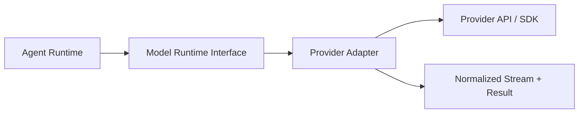

# Provider Adapter Specification

## Purpose

This document defines the language-neutral provider adapter layer for chat, streaming, tool calls, embeddings, structured output, image/video generation where relevant, error normalization, and fallback.

The goal is to let the agent runtime call every model provider through one normalized contract while preserving provider-specific capabilities behind adapters.

## Provider Adapter Boundary

The agent runtime must never directly depend on provider SDKs or provider wire formats.



The adapter owns:

- provider authentication
- provider request payload conversion
- provider stream parsing
- provider tool-call format conversion
- provider response normalization
- provider error normalization
- model list fetching
- embeddings
- structured output
- provider-specific capability flags

The adapter must not own:

- agent state
- operation persistence
- UI rendering
- memory policy
- tool execution
- human approval policy

## Normalized Model Runtime Interface

```ts
interface ModelRuntime {
  chat(
    request: ChatCompletionRequest,
    options?: ChatOptions,
  ): Promise<ChatCompletionResult | ReadableStream>;
  generateObject?(
    request: GenerateObjectRequest,
    options?: ChatOptions,
  ): Promise<GenerateObjectResult>;
  embeddings?(request: EmbeddingsRequest): Promise<EmbeddingsResult>;
  models?(): Promise<ModelRecord[]>;
}
```

## ChatCompletionRequest

```ts
interface ChatCompletionRequest {
  provider: string;
  model: string;
  messages: ModelMessage[];
  tools?: UniformModelTool[];
  toolChoice?: 'auto' | 'none' | { name: string };
  stream?: boolean;
  responseFormat?: {
    type: 'json_object' | 'json_schema' | 'text';
    schema?: unknown;
    name?: string;
  };
  params?: {
    temperature?: number;
    topP?: number;
    topK?: number;
    maxTokens?: number;
    presencePenalty?: number;
    frequencyPenalty?: number;
    stop?: string[];
    reasoning?: unknown;
    seed?: number;
  };
  metadata?: {
    userId?: string;
    operationId?: string;
    trigger?: string;
    traceId?: string;
    [key: string]: unknown;
  };
}
```

## ModelMessage

```ts
type ModelMessageRole = 'system' | 'user' | 'assistant' | 'tool';

interface ModelMessage {
  id?: string;
  role: ModelMessageRole;
  content: string | ModelContentPart[];
  name?: string;
  toolCallId?: string;
  toolCalls?: ChatToolPayload[];
  metadata?: Record<string, unknown>;
}

type ModelContentPart =
  | { type: 'text'; text: string }
  | { type: 'image'; imageUrl?: string; data?: string; mimeType?: string }
  | { type: 'file'; fileId?: string; url?: string; mimeType?: string; name?: string }
  | { type: 'reasoning'; text: string };
```

Rules:

- The context engine produces `ModelMessage[]`.
- Provider adapters convert these messages into the provider-specific shape.
- Tool result messages use role `tool` and must include `toolCallId`.
- Multimodal content must be dropped or rejected when the model lacks the required capability.

## UniformModelTool

```ts
interface UniformModelTool {
  type: 'function';
  function: {
    name: string;
    description?: string;
    parameters: Record<string, unknown>;
  };
}
```

Rules:

- `function.name` is model-facing and may be different from the original tool identifier.
- Names must be valid for the target provider. If the provider restricts characters, the tool engine must map and persist the mapping.
- `parameters` must be a JSON Schema object. If a source schema is a string, `undefined`, boolean schema, or invalid schema, the adapter boundary must normalize it to an object schema before sending.
- Providers that do not support tools must reject tool requests with `MODEL_CAPABILITY_MISMATCH`.

## ChatCompletionResult

```ts
interface ChatCompletionResult {
  message: ModelMessage;
  content?: string;
  reasoning?: string;
  toolCalls?: ChatToolPayload[];
  usage?: Usage;
  finishReason?: NormalizedFinishReason;
  rawFinishReason?: string;
  raw?: unknown;
}
```

## NormalizedFinishReason

```ts
type NormalizedFinishReason =
  | 'stop'
  | 'length'
  | 'tool_calls'
  | 'content_filter'
  | 'error'
  | 'cancelled'
  | 'unknown';
```

## Streaming Contract

Adapters must convert provider streams into normalized chunks before the runtime sees them.

```ts
type ModelStreamChunk =
  | { type: 'text_delta'; delta: string }
  | { type: 'reasoning_delta'; delta: string }
  | { type: 'tool_call_delta'; index?: number; id?: string; name?: string; argumentsDelta?: string }
  | { type: 'usage'; usage: Usage }
  | { type: 'finish'; finishReason: NormalizedFinishReason; rawFinishReason?: string }
  | { type: 'error'; error: ProviderError };
```

Rules:

- Adapters must tolerate partial JSON for tool-call arguments while streaming.
- Adapters must emit a final parsed `ChatToolPayload[]` or a normalized parse error before the runtime executes tools.
- Adapters should not emit provider-specific event names to runtime callers.
- If a provider only supports non-streaming responses, the adapter may synthesize a stream from the final result.

## ChatToolPayload

```ts
interface ChatToolPayload {
  id: string;
  type: 'function';
  function: {
    name: string;
    arguments: string | Record<string, unknown>;
  };
  metadata?: {
    identifier?: string;
    source?: string;
    displayName?: string;
    [key: string]: unknown;
  };
}
```

Rules:

- `function.name` is the model-facing name.
- Runtime/tool router resolves it through the operation tool name mapping.
- `function.arguments` may be a raw JSON string at parse boundaries but must become an object before executor invocation.
- Invalid final arguments should create a `TOOL_ARGUMENT_PARSE_ERROR` and must not crash the operation without a structured error event.

## Tool Schema Normalization

Provider adapters and tool engines must enforce:

```ts
interface NormalizedJsonSchemaObject {
  type: 'object';
  properties: Record<string, unknown>;
  required?: string[];
  additionalProperties?: boolean | Record<string, unknown>;
  description?: string;
}
```

Normalization rules:

- Missing schema becomes `{ type: 'object', properties: {} }`.
- String schema is invalid and must be converted only if it is parseable JSON object; otherwise use empty object schema and log/report.
- Boolean schema is not sent directly to providers that reject it.
- Root array schemas must be wrapped in an object property.
- `$ref` may be preserved only if the provider supports it; otherwise dereference or reject.
- Remove unsupported JSON Schema keywords per provider capability.

## Provider Capabilities

```ts
interface ProviderCapabilities {
  chat: boolean;
  streaming: boolean;
  tools: boolean;
  parallelToolCalls?: boolean;
  structuredOutput?: boolean;
  jsonMode?: boolean;
  vision?: boolean;
  audio?: boolean;
  embeddings?: boolean;
  reasoning?: boolean;
  imageGeneration?: boolean;
  videoGeneration?: boolean;
  contextCaching?: boolean;
}
```

Model capabilities may override provider-level capabilities.

## Parameter Normalization

Adapters must own provider-specific parameter rules:

- Omit unsupported sampling params.
- Handle provider/model conflicts such as temperature/top-p incompatibility.
- Convert `maxTokens` to provider-specific field names.
- Convert reasoning settings to provider-specific shape.
- Disable streaming for models known not to support it.
- Preserve user-provided provider/model identifiers unless a configured router/fallback intentionally maps them.

If a parameter cannot be represented, the adapter should drop it with debug metadata rather than fail, unless the parameter is required for correctness.

## Structured Output

```ts
interface GenerateObjectRequest {
  provider: string;
  model: string;
  messages: ModelMessage[];
  schema: Record<string, unknown>;
  tools?: UniformModelTool[];
  params?: Record<string, unknown>;
}

interface GenerateObjectResult {
  object: unknown;
  usage?: Usage;
  raw?: unknown;
}
```

Rules:

- Providers with native structured output should use it.
- Providers without native support may use prompt/schema enforcement and JSON parsing.
- Schema validation failure must return `STRUCTURED_OUTPUT_VALIDATION_ERROR`.

## Embeddings

```ts
interface EmbeddingsRequest {
  provider: string;
  model: string;
  input: string | string[];
  dimensions?: number;
  metadata?: Record<string, unknown>;
}

interface EmbeddingsResult {
  embeddings: number[][];
  usage?: Usage;
  model?: string;
  dimensions?: number;
}
```

Rules:

- Single input must return one embedding.
- Batch input order must be preserved.
- Implementations should store embedding model and dimensions with vector records.
- If provider returns normalized vectors, preserve as-is; otherwise do not silently normalize unless configured.

## Provider Errors

```ts
interface ProviderError {
  code: ProviderErrorCode;
  message: string;
  provider: string;
  model?: string;
  status?: number;
  retryable?: boolean;
  raw?: unknown;
}

type ProviderErrorCode =
  | 'PROVIDER_AUTH_ERROR'
  | 'PROVIDER_RATE_LIMIT'
  | 'PROVIDER_QUOTA_EXCEEDED'
  | 'MODEL_NOT_FOUND'
  | 'MODEL_UNAVAILABLE'
  | 'MODEL_CONTEXT_WINDOW_EXCEEDED'
  | 'MODEL_CAPABILITY_MISMATCH'
  | 'CONTENT_FILTERED'
  | 'TOOL_ARGUMENT_PARSE_ERROR'
  | 'STRUCTURED_OUTPUT_VALIDATION_ERROR'
  | 'PROVIDER_TIMEOUT'
  | 'PROVIDER_NETWORK_ERROR'
  | 'PROVIDER_BAD_REQUEST'
  | 'PROVIDER_ERROR';
```

Rules:

- Never expose raw API keys or request headers in `raw`.
- Preserve provider/model/status for debugging.
- Mark retryable only when retrying the same request can plausibly succeed.
- Context window errors should be distinguishable so runtime can trigger compression.

## Fallback And Routing

Adapters may be wrapped in a router runtime:

```ts
interface ProviderRoute {
  provider: string;
  apiType?: string;
  models?: string[];
  priority?: number;
  configRef?: string;
}
```

Rules:

- Route by explicit provider/model first.
- If multiple routes match, try in configured order.
- Fallback must preserve the requested logical model unless a route explicitly maps it.
- Each failed attempt should emit trace/debug metadata.
- Final error should include all attempted providers in details.

## Model Listing

`models()` should return normalized `ModelRecord[]`:

```ts
interface ModelRecord {
  id: string;
  providerId: string;
  displayName?: string;
  description?: string;
  enabled?: boolean;
  abilities: Record<string, boolean>;
  contextWindow?: number;
  maxOutput?: number;
  pricing?: Record<string, unknown>;
  raw?: unknown;
}
```

Rules:

- Merge provider live models with local model metadata where available.
- Preserve unknown provider fields in `raw` only for server-side debugging.
- UI should use normalized capabilities, not provider-specific raw fields.

## Security

Provider adapters must:

- Read credentials only from secure server-side config or encrypted user settings.
- Never send provider keys to browser UI.
- Redact credentials from logs and traces.
- Support per-user provider config where product requirements require it.
- Support service-level provider config for hosted defaults.

## Conformance Requirements

A provider adapter is compatible when it passes:

- non-stream chat text response
- stream text response
- stream reasoning response when supported
- tool-call request and final tool-call parsing
- invalid tool argument error normalization
- structured output success/failure when supported
- embeddings success/failure when supported
- missing API key error
- model not found error
- context window exceeded error
- fallback attempt ordering when routed
